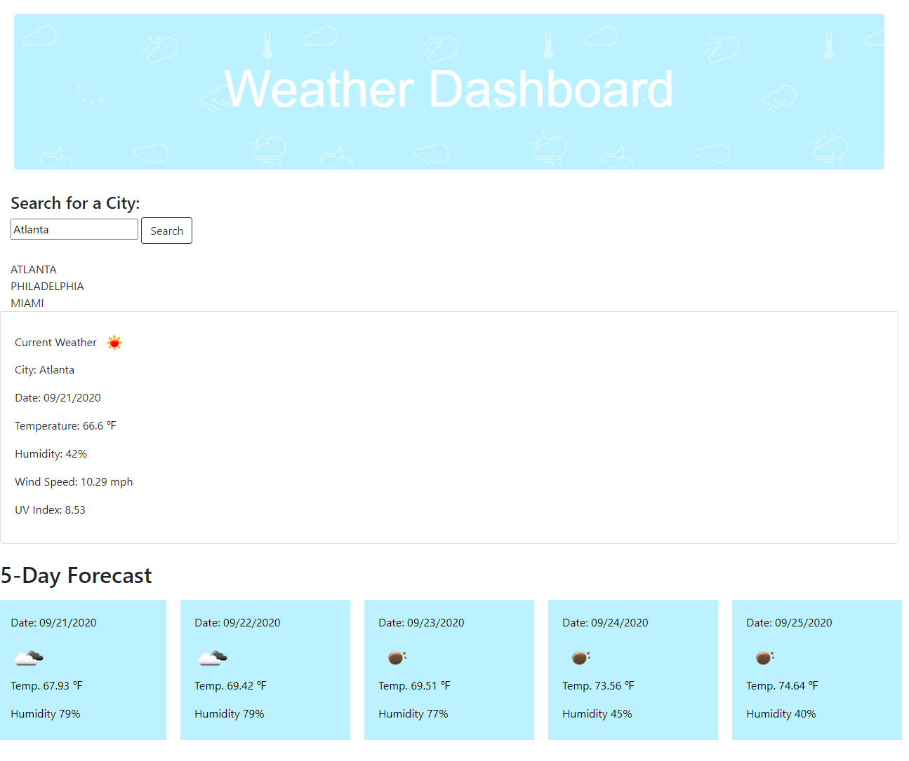

# 🌤️ Weather Dashboard

### [CLICK HERE TO VIEW LIVE SITE](https://kristykeller.github.io/weather-dashboard/)

## User Story
```
As A traveler
I want to see the weather outlook for multiple cities
So that I can plan a trip accordingly
```

## Application Description 
A weather dashboard that allows the user to search for a city that is then displayed to his or her search history. Current and future weather forecasts are presented through a 5-day forecast. Each day has the city name, the date, an icon representation of weather conditions, the temperature, the humidity, the wind speed, and the UV index. The UV index is assigned a color that showcases whether the conditions are favorable, moderate, or severe. The user can navigate using previously searched cities via the search history list.

## Demo


## Screenshot


## Built With
* OpenWeatherMap API
* Bootstrap 
* Moment.js 
* JavaScript
* jQuery
* HTML
* CSS

## License
[](https://opensource.org/licenses/MIT)

Copyright 2020 ©Kristy Keller

<sup>Permission is hereby granted, free of charge, to any person obtaining a copy of this software and associated documentation files (the "Software"), to deal in the Software without restriction, including without limitation the rights to use, copy, modify, merge, publish, distribute, sublicense, and/or sell copies of the Software, and to permit persons to whom the Software is furnished to do so, subject to the following conditions:
  
<sup>The above copyright notice and this permission notice shall be included in all copies or substantial portions of the Software.

<sup>THE SOFTWARE IS PROVIDED "AS IS", WITHOUT WARRANTY OF ANY KIND, EXPRESS OR IMPLIED, INCLUDING BUT NOT LIMITED TO THE WARRANTIES OF MERCHANTABILITY, FITNESS FOR A PARTICULAR PURPOSE AND NONINFRINGEMENT. IN NO EVENT SHALL THE AUTHORS OR COPYRIGHT HOLDERS BE LIABLE FOR ANY CLAIM, DAMAGES OR OTHER LIABILITY, WHETHER IN AN ACTION OF CONTRACT, TORT OR OTHERWISE, ARISING FROM, OUT OF OR IN CONNECTION WITH THE SOFTWARE OR THE USE OR OTHER DEALINGS IN THE SOFTWARE.

## Questions

If you have any questions regarding this repo, please contact me at the following:

* <keller.kristy@outlook.com>

* [KristyKeller](https://github.com/KristyKeller)
